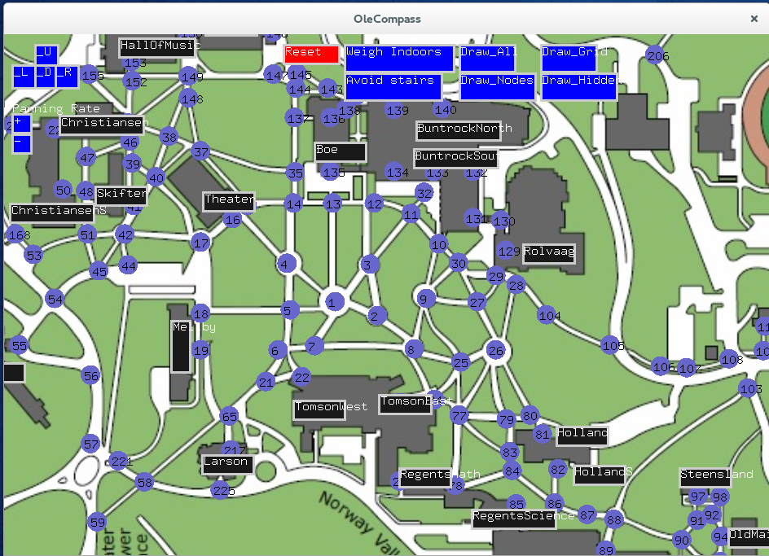

# Ole Compass
> The shortest path around campus

## The Overview

The Ole Compass program was designed to help both current students and visitors efficiently navigate St. Olaf’s campus. A variant on the infamous “shortest-path” problem, this program uses a database of all the sidewalks, paths, and tunnels on campus to generate an optimized path based on someone’s current location to a designated location, and displays the path in an user friendly manner.

Through an easy-to-use graphical interface, users may easily select their current position and their intended endpoint. The program will then give them both a graphical map outlining the optimal path as well as a textual list of directions. Once the outline is displayed, the program will provide step­by­step directions leading the user to their destination.

## Interacting with the Program
### User Input

When first opening the program, the user will be shown a map of St. Olaf’s campus. The map will have highlighted nodes and buildings. The map will initially be zoomed in on the quad area, and the user will be able to use the arrow keys on the keyboard to pan around the map. Additionally, there are buttons on the screen which will also be able to pan through the map.

The displayed map will also have options for other types of paths the user would like generated. There is a button allowing the user to prefer indoor paths when possible. This would weigh outdoor paths more heavily so the program will take indoors when possible. Similarly, there is a button for the user to avoid stairs. In the case where some users may be unable to use stairs for whatever reason, this feature will force the path to avoid paths with stairs. A limitation here, is that the map does not consider elevators to be an option so some paths may be inaccurate when there is an elevator present.

Each building will have a button with the name of the building on it, which the user may select simply by clicking the button or on a node directly. The user will first select his/her current location. After inputting their location, users will be then select his/her destination from the same map. After the first selection, the selected node will be highlighted and the program will await a second input. After a second node has been selected, a popup window will appear.

This window will ask for confirmation for the path to be calculated. It will return the start and finish locations that the user selected, and ask to compute it. By pressing the “yes” button, the locations will be sent to the algorithm and the program will calculate and display the path. Pressing “no,” will reset the start and finish locations and the program will again wait for input.

A reset button is at the top of the screen. At any point, pressing this button will revert the program to the state it opened in. It will revert weights to default, drawing to default, and delete any destination previously entered. After a path is drawn, it is necessary to press this reset button before selecting a new path.

### Interpreting the Program’s Output

Once confirmation from the user is given, via the popup window, the program will proceed to highlight a path on the map, connecting the selected nodes which would represent the optimal path to travel.

Likewise, in the terminal window, the program will tell the user the number of nodes they are starting at and finishing at. It will also give a list of the nodes you must travel to get to your destination. This list of nodes is the same path as the ones that are highlighted on the map. The last output in the terminal window is the distance calculation. This distance is calculated in pixels on the screen. It is set up to give the true pixel distance along the path regardless of which weights are applied to the path (for example, if outdoors are weighted, the distance will be properly calculated ignoring the weight).

### Additional Input Features

As users may find, when the map is displayed on the map, the view itself may begin to appear very cluttered as buttons, nodes, and the path are all being displayed. As a result, the user will find additional buttons at the top of the screen. Aside from the the weighing indoor/outdoor and stairs buttons, there are buttons labeled “Draw_all,” “Draw_Nodes,” “Draw_Grid,” and “Draw_hidden.”

The “Draw_all” (Fig. 2.5) button will remove everything currently drawn except for the map and the path that is drawn. Thereby removing buttons and nodes and making the view easier to see. Be aware that buttons may still be clicked even if they are not drawn so be weary of additional input.

Next, the “Draw_Nodes” button will remove only the nodes from the map and leave the buttons and path still drawn. Again, even while not drawn, nodes may still be pressed.

In the programming of the program, it was necessary to create additional nodes to optimize the path length and show curved paths properly. To avoid additional clutter, these additional nodes are, by default, set to invisible. The “Draw_hidden” button will draw all these invisible nodes if the user so desires.

Lastly, the “Draw_Grid” (Fig. 2.6) button will draw all connections between all possible nodes. This allows users to see which paths are traversable. This comes as a result of maps not being one hundred percent accurate. Some paths may be drawn on the map but not actually traversable by foot, such as larger roads. Furthermore, some paths may be missing that were added as the program expanded through the inclusion of additional nodes and paths. If the user is unsure about a path, the Grid will easily allow them to see which paths are set up in the program.

## Additional and extra Features

### Minimization of other Parameters

The program is set up such that additional parameters may be included to weigh. While our version of the program only included weighing stairs and the outdoors, it would not be very difficult to edit from the source code to include other parameters, such as certain types of paths or time.

### Input of walking speed

The original goal of the program was to measure distances in meters or feet rather than pixels. In a similar fashion to the weights above, the program would not be very difficult to include a more standard distance unit. From here, the input of walking speed, a feature originally hoped for, would not be too far off.

### Node expansion

As we found, probably the most laborious portion of the creating the program was the data entry of nodes. In the end, we have a method in which adding additional nodes into the map is fairly simple. While not as easy as simply clicking where you want one, it takes not very much time to add nodes and the program would interpret it properly.

### Further expansion of the program

A side goal for the project was for the code to be user friendly if anyone were to edit the source code. As such, adding buttons, nodes, or new features would not be too difficult as the code should be able to support sufficient expansion.

### Limitations

As stated before, there are a few limitations of the program. Probably one of the most prominent is that the paths can only be as good as the map they are laid out on. As is such, the map we have chosen was terribly inaccurate. While a great effort was made to correct it as much as possible, there are still errors that exist in our final version of the program.

Furthermore, there are cases where not all the paths are accounted for. Such as the option to weigh stairs does not then account for elevators that may be present around campus. There are also numerous paths of varying quality that become present in different seasons. These paths are not always portrayed in our program. While some are, there will always be paths that are traversable, but not shown on our map.
